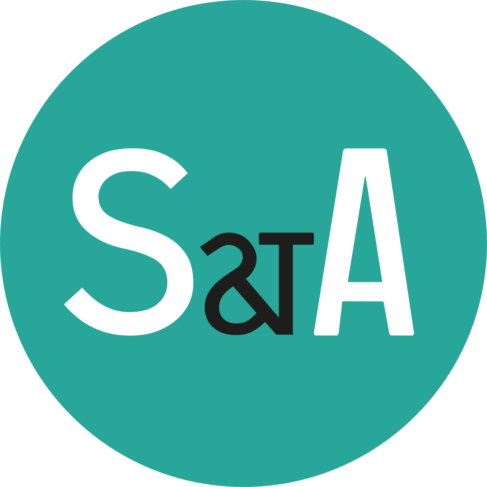
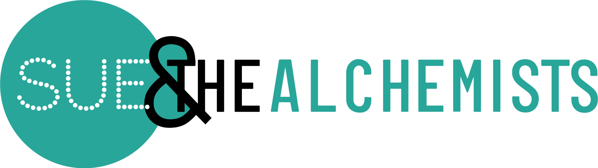

# SUE & The Alchemists Brand Identity

Apply SUE & The Alchemists (SATA) brand guidelines to all created content including presentations, documents, social media posts, and marketing materials.

## Brand Names & Terminology

Use these exact spellings consistently:

- **SUE & the Alchemists** (full name)
- **SatA** (abbreviation)
- **We are SatA** (website reference)
- **Behavioural Design** (British spelling)

## Logo Usage

All logos are available in the `assets/` directory. Select the appropriate logo based on the application:

### Primary Logos

**The Vinyl** (`The_vinyl.png`, `The_Vinyl_Wit.png`)
- **Use for:** Business cards, cover pages, presentations (title slides)
- **When:** Space allows for the full circular vinyl design
- **Variants:** Black/white with teal center or inverted white/black

**Off-the-record** (`Off_the_record.png`, `Off_the_record_opgroen.png`, `Off_the_record_opzwart.png`)
- **Use for:** Document headers, website headers, email signatures
- **Standard placement:** Bottom right corner of slides and documents
- **When:** The circular vinyl logo would be too large or doesn't fit the layout
- **Variants:** Teal on white, teal on green background, teal on black background

**The Label** (`The_Label.png`)
- **Use for:** Favicons, app icons, small social media avatars
- **When:** Minimal space requires icon-only representation
- **Format:** Circular S&A abbreviation on teal background

**The Dot** (`The_Dot.png`)
- **Use for:** Website branding (wearesata.com references)
- **When:** Emphasizing the website connection

**The Groove** (`The_Groove_Groen.png`)
- **Use for:** Visual overlays on imagery, backgrounds, decorative elements
- **When:** Adding brand pattern to photos or creating visual depth

### Logo Placement Rules

**For presentations:**
- Title/cover slides: Use **The Label** logo (centered or positioned aesthetically)
- All other slides: Use **Off-the-record** logo in bottom right corner

**For documents:**
- Headers: Use **Off-the-record** logo
- Cover pages: Use **The Vinyl** logo

**Never:**
- Modify logo proportions, colors, or structure
- Add effects (shadows, gradients) to logos
- Place logos on busy backgrounds that compromise legibility

## Color Palette

### Primary Colors

**SATA Teal** (Primary Brand Color)
- CMYK: C75 M9 Y46 K0
- RGB: R40 G166 B154
- HEX: #28a69a
- **Use for:** Accents, call-to-action elements, borders, highlights

**Black**
- CMYK: C100 M100 Y100 K100
- RGB: R0 G0 B0
- HEX: #000000
- **Use for:** Text, high-contrast backgrounds, professional elements

**White**
- CMYK: C0 M0 Y0 K0
- RGB: R255 G255 B255
- HEX: #ffffff
- **Use for:** Backgrounds, text on dark surfaces, clean spaces

### Application Guidelines

**Dominant color strategy:** One color should clearly dominate (60-70% visual weight). For SATA materials:
- **Executive/professional contexts:** Black or white dominant with teal accents
- **Creative/campaign contexts:** Teal dominant with black/white contrast

**Background choices:**
- Black backgrounds: Creates premium, executive feel (use for boardroom pitches, leadership content)
- White backgrounds: Clean, accessible, versatile (use for reports, documents)
- Teal backgrounds: Bold, distinctive (use for key messages, call-out boxes)

**Avoid:**
- Generic gradients
- Multiple competing colors
- Teal + other bright colors (maintain the teal/black/white palette)

## Typography

### Primary Fonts

**Open Sans Bold** (or Arial Bold as web-safe alternative)
- **Use for:** Titles, headings, important statements
- Weight: 700
- **Application:** All H1, H2 elements, emphasis text

**Open Sans Light** (or Arial as web-safe alternative)
- **Use for:** Body text, descriptions, supporting content
- Weight: 300
- **Application:** Paragraphs, lists, explanatory text

**Georgia Italic**
- **Use for:** Quotes, testimonials, emphasized statements
- Style: Italic
- **Application:** Pull quotes, attributed statements

### Typography Rules

**For presentations:**
- Title slides: 54-64px for main title
- Section headers: 38-42px
- Body text: 12-16px
- Footnotes: 8-10pt

**For documents:**
- Document titles: 24-32pt
- Section headers: 18-20pt
- Body text: 11-12pt
- Footnotes: 9-10pt

**Hierarchy:**
- Create clear visual distinction between title, headers, and body
- Use weight (bold vs. light) rather than multiple font families
- Maintain consistent line-height (1.4-1.6 for body text)

## Tone of Voice

### Core Principles

**Rational and analytical**
- Prioritize well-crafted arguments over emotional appeals
- Avoid hyperbole words like "brilliant," "genius," "amazing"
- Focus on underlying patterns and mental models

**Clear and accessible**
- Use simple language (B1 level on ishetb1.nl)
- Sentences: max 15 words
- Paragraphs: max 50 words
- Avoid jargon; use simple alternatives

**Professional but approachable**
- Friendly tone without being casual (tutoyeren unless formal context requires otherwise)
- Use British English spelling (organisation, behaviour, analyse)
- Avoid excessive English terms in Dutch text

### Content Focus

**Talk about the client, not yourself**
- The client/brand is always central
- Discuss SATA's approach in service of client outcomes
- Frame expertise as tools for client success

**Structured communication**
- Lead with main point
- Support with evidence and examples
- Avoid long, winding narratives

## Design Elements & Patterns

### The Vinyl Motif

The circular vinyl record pattern is SATA's distinctive visual element:

**Applications:**
- Background element (low opacity: 0.10-0.15)
- Decorative overlay on images
- Section dividers
- Visual anchors for asymmetric layouts

**Usage:**
- Position off-center or partially off-screen for dynamic feel
- Use The_Groove_Groen.png for overlays
- Combine with diagonal or asymmetric layouts

### Layout Principles

**Asymmetry and dynamism**
- Avoid centered, symmetrical layouts
- Use 30/70 or 40/60 splits rather than 50/50
- Position elements at slide edges for boldness

**Whitespace**
- Use generous margins (minimum 40-70px for presentations)
- Create breathing room around key elements
- Don't fill every space

**Visual hierarchy**
- One clear focal point per page/slide
- Size, color, and position create hierarchy
- Teal accent bars (4-8px width) guide the eye

## Presentation Design

### Slide Structure

**Title slides:**
- Large, bold title (SATA or project name)
- Teal accent bar (4-6px) under title
- Subtitle or tagline in teal
- The Label logo positioned aesthetically
- Black or teal background for impact

**Content slides:**
- Clear header (border-bottom: 3px solid #28a69a)
- Body content with generous padding (35-50px top)
- Off-the-record logo bottom right
- Footer: company name left, page number right

**Visual slides:**
- Use The Groove overlay on images
- Maintain teal/black/white color scheme
- Bold typography over images requires high contrast

### Presentation Best Practices

**Executive/boardroom presentations:**
- Black backgrounds convey authority
- Minimal text, maximum impact
- Focus on frameworks and mental models
- Use teal strategically for key messages

**Training/educational content:**
- White backgrounds for readability
- Structured content with clear sections
- Use numbered lists and frameworks
- Teal accents for emphasis

## Document Design

**Headers:**
- Off-the-record logo right-aligned
- Document title in Open Sans Bold
- Teal accent line (1-2px) under header

**Body:**
- Generous margins (2.5-3cm)
- Open Sans Light for body text
- Teal for section breaks or call-out boxes

**Footers:**
- Company name, page numbers, date
- Minimal, 9-10pt text

## Social Media & Digital

**Colors:** Maintain teal/black/white palette
**Logos:** The Label for profile pictures, Off-the-record for cover images
**Typography:** Bold statements, minimal text
**Imagery:** Use The Groove overlay for brand consistency

## Resources

### Logo Assets

All logo files are in `assets/`:
- `The_vinyl.png` - Full vinyl logo (black version)
- `The_Vinyl_Wit.png` - Full vinyl logo (white version)
- `Off_the_record.png` - Horizontal logo (teal on white)
- `Off_the_record_opgroen.png` - Horizontal logo (teal on green)
- `Off_the_record_opzwart.png` - Horizontal logo (teal on black)
- `The_Label.png` - Icon logo (S&A on teal circle)
- `The_Dot.png` - Website logo (We are SatA)
- `The_Groove_Groen.png` - Vinyl groove pattern overlay

### Usage in Code

When creating presentations or documents programmatically:

```python
# For presentations - add logo to slides
from pptx.util import Inches

# Title slide - use The Label
slide.shapes.add_picture('assets/The_Label.png', 
    left=Inches(8), top=Inches(0.5), height=Inches(0.8))

# Content slides - use Off-the-record  
slide.shapes.add_picture('assets/Off_the_record.png',
    left=Inches(8.5), top=Inches(5), height=Inches(0.4))
```

For HTML presentations:

```html
<!-- Title slide -->


<!-- Content slides -->

```

## Quality Checklist

Before delivering SATA-branded content, verify:

- [ ] Correct brand name spelling (SUE & the Alchemists, SatA)
- [ ] Appropriate logo used and correctly placed
- [ ] Color palette adhered to (teal #28a69a, black, white only)
- [ ] Typography follows guidelines (Arial/Open Sans, appropriate weights)
- [ ] Tone is rational, clear, and analytical
- [ ] British English used (organisation, behaviour, etc.)
- [ ] Content is client-focused, not self-promotional
- [ ] Visual hierarchy is clear and intentional
- [ ] Whitespace is generous and purposeful
- [ ] No generic AI aesthetics or clichéd design choices
